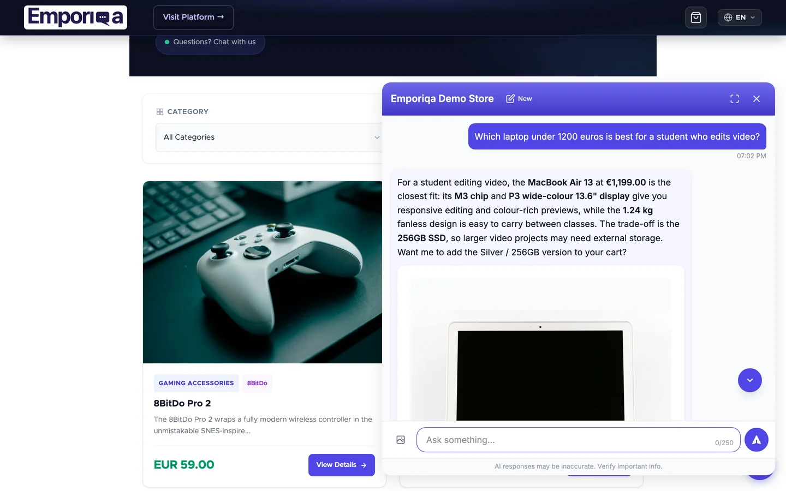

# Emporiqa: AI Chatbot for Shopware 6

*[Deutsche Fassung](README_de-DE.md)*

The [Emporiqa](https://emporiqa.com) AI chatbot for Shopware 6 is an online salesperson that closes sales in your store: shoppers describe what they need or upload a photo of something they like, it finds matching products from your catalog, handles objections like "too expensive" with alternatives instead of a discount, answers questions from your CMS pages, and walks shoppers to cart and checkout in 65+ languages. This plugin syncs your product catalog and CMS pages to Emporiqa, embeds the chat widget on your storefront, and exposes endpoints for in-chat cart operations and order tracking.

[](https://demo.emporiqa.com)

- **Integration overview**: [emporiqa.com/integrations/shopware/](https://emporiqa.com/integrations/shopware/)
- **Full documentation**: [emporiqa.com/docs/shopware/](https://emporiqa.com/docs/shopware/) (webhook format reference, CLI and admin API reference, event examples, troubleshooting)
- **Features**: [emporiqa.com/features/](https://emporiqa.com/features/) · **FAQ**: [emporiqa.com/faq/](https://emporiqa.com/faq/) · **Pricing**: [emporiqa.com/pricing/](https://emporiqa.com/pricing/)
- **Live demo**: [demo.emporiqa.com](https://demo.emporiqa.com) and a [30-second video](https://www.youtube.com/watch?v=as54_uvk038). That demo sells electronics, and the behavior is the same on any catalog.

## Requirements

- Shopware 6.6 or 6.7
- PHP 8.2+
- An [Emporiqa account](https://emporiqa.com/platform/create-store/). Sign up with no card; $25 of signup credit (~100 free conversations) auto-applied

## Installation

### Via the Extension Manager

1. Download the latest `EmporiqaIntegration-x.y.z.zip` from the [Releases](https://github.com/emporiqa/shopware/releases) page.
2. In your Shopware Administration, go to **Extensions > My Extensions > Upload extension** and upload the zip.
3. Install and activate the extension.

### Via Composer (self-hosted)

```bash
composer require emporiqa/shopware-plugin
bin/console plugin:refresh
bin/console plugin:install --activate EmporiqaIntegration
bin/console cache:clear
```

### Connect and sync

After installing by either method above:

1. Open the Emporiqa extension and click **Connect to Emporiqa**. A new tab opens on emporiqa.com. Create a free account (no card required, $25 of signup credit) or sign in if you already have one, then pick the store you want to connect (or create a new one). The plugin is connected when you return.
2. On the **Sync** tab, click **Sync All**. Products and pages flow through; the widget appears on your storefront when the first product arrives.

**On HTTP, or prefer to paste credentials yourself?** In the Connection settings, paste a **Store ID** and **Webhook Secret** from your Emporiqa dashboard under **Settings → Integration**. Both flows reach the same place.

For order tracking, copy the **Order Tracking URL** shown on the settings page and paste it into your Emporiqa dashboard under **Integration → Order tracking** (the URL is also auto-derived by one-click connect on most setups).

## Configuration

All settings are managed from the plugin configuration page (**Extensions > My Extensions > Emporiqa > ⋯ > Settings**):

**Connection Settings**

The recommended path is **Connect to Emporiqa** (one-click handshake, no credentials to paste). For HTTP sites or manual setup, enter the values by hand:

| Setting | Description | Default |
|---------|-------------|---------|
| Store ID | Your Emporiqa store identifier (filled automatically by one-click connect) | (none) |
| Webhook Secret | HMAC-SHA256 signing secret (filled automatically by one-click connect) | (none) |
| Order Tracking URL | Read-only endpoint to paste into your Emporiqa dashboard | auto-generated |

**Advanced**

| Setting | Description | Default |
|---------|-------------|---------|
| Sync Products | Enable real-time product sync | On |
| Sync Pages | Enable real-time CMS page sync | On |
| Webhook URL | Emporiqa webhook endpoint | `https://emporiqa.com/webhooks/sync/` |
| Batch Size | Products/pages per webhook request during bulk sync | 50 |

Order tracking (with customer email verification) and in-chat cart operations are always enabled. No configuration needed.

## AI disclosure

The chat's default greeting tells the shopper it is the store's AI assistant, in every language the chat speaks. A custom greeting must keep that disclosure; one that drops it is refused when you save it. Section 8.6 of the [Emporiqa Terms](https://emporiqa.com/terms-of-service/) treats removing the disclosure, including through custom CSS or custom code, as a breach.

## Keeping your catalog in sync

The plugin pushes product, page, and order changes to Emporiqa automatically as they happen, through Shopware's data layer (DAL) events. Pure stock or out-of-stock changes emit a compact availability-only update instead of rebuilding the whole product, and product media or price changes re-emit the affected product on their own.

Some changes affect the whole catalog (category, brand, or currency edits, a new language, promotion changes). Running a synchronous per-product re-sync from those events would block the admin request, so the plugin logs an actionable warning to Shopware's log (`var/log/`) instead and leaves the catalog refresh to a manual run.

Re-run a full sync from the **Sync** tab when:

- You see one of the "catalog-wide change" warnings in the Shopware log
- You add or reassign a sales channel (existing products won't carry the new channel's data until something else touches them)
- You import products in bulk or write catalog data directly to the database (bulk paths can bypass standard events)
- Emporiqa was unreachable for an extended period (network outage, planned maintenance, expired credentials)

As a safety net, run a full sync once a week to catch any drift that may have built up from background failures.

## Product payload fields

Beyond the fields shown in the [webhook payload reference](https://emporiqa.com/docs/shopware/), the full product and variant payload carries these merchandising and pricing fields:

- `tier_prices`: per-currency list of quantity-based breaks (`[{min_quantity, price}]`) from Shopware's advanced rule prices, present on a price entry only when the product or variant has them configured.
- `is_virtual`: boolean; true for downloadable products with no shipping (from Shopware's downloadable-product state).
- `condition`: included for cross-platform payload parity. Shopware has no native product-condition field, so it ships as a fixed `null`.
- `available_for_order`: included for cross-platform payload parity. Shopware has no native display-only / catalog-mode flag, so it ships as a fixed `true`.

These fields are part of the full product and variant payload, not the lightweight `product.availability` event, which carries only the identification number, SKU, per-channel availability statuses, and stock quantities.

## Plugin structure

```
EmporiqaIntegration/
├── src/
│   ├── EmporiqaIntegration.php          # Plugin lifecycle (uninstall cleanup: config + order markers)
│   ├── Command/                         # CLI: sync:products, sync:pages, sync:all, test-connection
│   ├── Controller/
│   │   ├── Admin/SyncController.php     # Admin sync + data-preview endpoints
│   │   ├── Admin/ConnectController.php  # One-click connect (PKCE) endpoints
│   │   ├── CartController.php           # In-chat cart API
│   │   └── OrderTrackingController.php  # HMAC-signed order tracking endpoint
│   ├── Service/
│   │   ├── SyncService.php              # Bulk sync orchestration + channel contexts
│   │   ├── ProductFormatter.php         # Product/variant payload formatting
│   │   ├── CmsPageFormatter.php         # Landing page / category page payload formatting
│   │   ├── ChannelResolver.php          # Sales channel to Emporiqa channel mapping
│   │   ├── ConnectService.php           # One-click connect (PKCE) handshake
│   │   ├── ConfigService.php            # Settings access
│   │   └── WebhookClient.php            # HMAC-SHA256 signed webhook HTTP client
│   ├── Subscriber/                      # Real-time DAL event listeners
│   ├── MessageQueue/                    # Async webhook and full-sync handlers
│   ├── Event/                           # Extension events (payload / widget hooks)
│   └── Resources/
│       ├── app/administration/          # Admin UI (sync dashboard, settings, one-click connect)
│       ├── app/storefront/              # Widget embed and cart storefront plugins
│       └── config/                      # config.xml, services, snippets
├── composer.json
└── CHANGELOG.md
```

## Registered subscribers

| Subscriber | Purpose |
|------------|---------|
| `StorefrontSubscriber` | Embeds the chat widget on the storefront (`StorefrontRenderEvent`) |
| `ProductSubscriber` | Syncs products on write/delete, variant-precise deletes, and re-syncs on media or price changes |
| `ProductSubscriber` (availability) | Emits a lightweight `product.availability` event on stock changes (`ProductStockAlteredEvent`), no full rebuild |
| `LandingPageSubscriber` | Syncs landing pages on create/update/delete |
| `CategorySubscriber` | Syncs category shop pages on create/update/delete |
| `OrderSubscriber` | Captures the chat session and sends `order.completed` on order placement and completing state transitions |
| `CatalogChangeSubscriber` | Logs an actionable warning for catalog-wide changes (category, manufacturer, currency, language, promotion, tax, pricing rule) so the merchant can run a full sync |

## Extensibility

Developers can subscribe to Symfony events to customize payloads or widget behavior:

| Event | Purpose |
|-------|---------|
| `PostProductFormatEvent` | Modify the product/variant payload before sending |
| `PostPageFormatEvent` | Modify the page payload before sending |
| `PostOrderFormatEvent` | Modify the order payload before sending |
| `OrderTrackingResponseEvent` | Modify the order tracking response |
| `WidgetParamsEvent` | Modify the chat widget embed parameters |
| `PreSyncEvent` / `PostSyncEvent` | Run logic before and after a bulk sync session |

Every service is defined against an interface (`ProductFormatterInterface`, `CmsPageFormatterInterface`, `SyncServiceInterface`, `WebhookClientInterface`, `ChannelResolverInterface`, `ConfigServiceInterface`, `ConnectServiceInterface`), so you can decorate any of them with a standard Symfony service decorator.

## Pricing

The plugin is free. The Emporiqa service itself is pay-as-you-go: $0/month base + $0.25/conversation, with $25 of signup credit and no card required at signup. Full pricing at [emporiqa.com/pricing/](https://emporiqa.com/pricing/).

## Support

Email support@emporiqa.com.

## License

[MIT](https://opensource.org/licenses/MIT)
